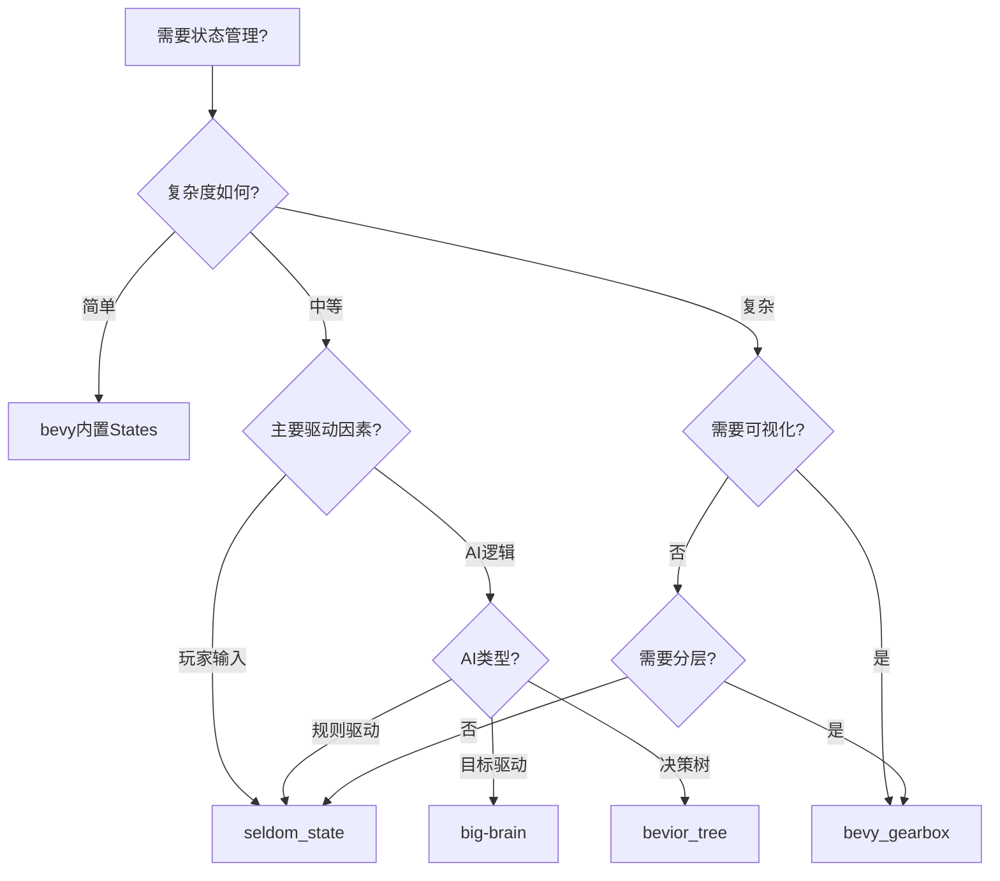

# Bevy 实体状态管理完全指南：从 FSM 到 HSM 的架构演进与实战选型

## 引言：为什么状态管理如此重要？

在现代游戏开发中，状态管理是连接游戏逻辑与玩家体验的核心桥梁。无论是角色的行走与跳跃、敌人的巡逻与攻击，还是UI的显示与隐藏，背后都是状态机在精确地协调着每一个转换。

对于采用 ECS（Entity Component System）架构的 Bevy 引擎而言，状态管理呈现出独特的挑战与机遇。本文将深入剖析 Bevy 生态系统中的状态管理方案，帮助您为项目选择最适合的工具。

## 一、Bevy 状态管理的两个维度

### 1.1 全局应用状态 vs 实体级状态

Bevy 的状态管理存在两个截然不同的层次：

**全局应用状态（bevy_state）**

```rust
#[derive(States, Default, Debug, Clone, PartialEq, Eq, Hash)]
enum AppState {
    #[default]
    MainMenu,
    InGame,
    Paused,
    GameOver,
}

// 控制系统运行
app.add_systems(Update, player_movement.run_if(in_state(AppState::InGame)));
```

**实体级状态**

```rust
// 每个实体有自己的状态
#[derive(Component)]
struct CharacterState {
    current: StateType,
    // 独立于应用状态
}
```

这种二元性反映了游戏开发的本质：既需要管理整体游戏流程，又需要处理成百上千个独立实体的行为逻辑。

### 1.2 为什么需要专门的实体状态管理？

- **规模问题**：一个游戏可能有数千个拥有独立状态的实体
- **复杂性管理**：角色可能有数十种状态和上百种转换
- **性能考虑**：需要高效地处理大量状态更新
- **团队协作**：设计师需要参与行为逻辑的调整

## 二、主流解决方案深度对比

### 2.1 seldom_state：优雅的触发器驱动 FSM

**核心理念**：响应式、声明式、人体工程学优先

```rust
use seldom_state::prelude::*;

// 状态即组件
#[derive(Component, Clone)]
struct Idle;

#[derive(Component, Clone)]
struct Jumping { 
    start_time: f32,
    initial_velocity: Vec3,
}

// 流畅的构建器模式
commands.spawn((
    StateMachine::new(Idle)
        .trans::<Jumping>(
            // 与 leafwing-input-manager 完美集成
            action_just_pressed(PlayerAction::Jump),
            |_: &Idle| Jumping { 
                start_time: time.elapsed_seconds(),
                initial_velocity: Vec3::Y * 10.0,
            }
        )
        .trans::<Idle>(
            // 内置丰富的触发器
            done().and(grounded()),
            |_: &Jumping| Idle
        )
        .on_enter::<Jumping>(play_jump_sound)
        .on_exit::<Jumping>(reset_animation),
));
```

**独特优势**：

- ✅ 30+ 内置触发器（计时器、事件、条件组合等）
- ✅ 与 leafwing-input-manager 深度集成（24个专门触发器）
- ✅ 状态间数据传递机制（trans_builder）
- ✅ 极其符合 Rust 习惯的 API

**最佳应用场景**：

- 响应式玩家控制器
- 输入驱动的游戏逻辑
- 中小规模的 AI 行为
- 快速原型开发

### 2.2 bevy_gearbox：工具驱动的分层状态机

**核心理念**：可视化优先、数据驱动、复杂性管理

```rust
// 现代实体图 API
use bevy_gearbox::prelude::*;

// 状态和转换都是实体！
fn setup_complex_ai(mut commands: Commands) {
    // 创建分层状态结构
    let combat = commands.spawn(Name::new("Combat")).id();
    let melee = commands.spawn((
        Name::new("Melee"),
        StateChildOf(combat), // 子状态
    )).id();
    let ranged = commands.spawn((
        Name::new("Ranged"),
        StateChildOf(combat),
    )).id();
    
    // 转换也是实体，支持守卫条件
    commands.spawn((
        Source(melee),
        Target(ranged),
        EventEdge::<SwitchToRangedEvent>::default(),
        Guard::new(|world, entity| {
            // 仅当有弹药时才能切换
            world.get::<Ammo>(entity)
                .map(|ammo| ammo.count > 0)
                .unwrap_or(false)
        }),
    ));
}
```

**革命性特性：bevy_gearbox_editor**

```rust
// 从编辑器生成的场景文件加载
commands.spawn(SceneBundle {
    scene: asset_server.load("boss_ai.scn.ron"),
    ..default()
});
```

**独特优势**：

- ✅ 原生分层状态机（HSM）支持
- ✅ 可视化编辑器（游戏设计师友好）
- ✅ 状态守卫（条件阻塞）
- ✅ 完全数据驱动（可序列化、可热加载）

**最佳应用场景**：

- 复杂 Boss AI
- 多阶段/多模式角色
- 大型团队协作项目
- 需要设计师参与的行为逻辑

### 2.3 big-brain：基于效用的 AI 系统

**核心理念**：智能决策、动态优先级、目标导向

```rust
use big_brain::prelude::*;

// 定义 AI 的"需求"
#[derive(Component, Debug)]
struct Thirsty { thirst: f32 }

#[derive(Component, Debug)]
struct Hungry { hunger: f32 }

// 行动及其效用评分
struct DrinkAction;
impl Action for DrinkAction {
    fn execute(&self, entity: Entity, world: &mut World) -> ActionResult {
        if let Some(mut thirsty) = world.get_mut::<Thirsty>(entity) {
            thirsty.thirst -= 50.0;
            ActionResult::Success
        } else {
            ActionResult::Failure
        }
    }
}

// 效用函数：越渴越想喝水
struct ThirstScorer;
impl Scorer for ThirstScorer {
    fn score(&self, entity: Entity, world: &World) -> f32 {
        world.get::<Thirsty>(entity)
            .map(|t| t.thirst / 100.0)
            .unwrap_or(0.0)
    }
}

// 组装 AI
commands.spawn((
    Thinker::build()
        .when(ThirstScorer, DrinkAction)
        .when(HungerScorer, EatAction)
        .when(TiredScorer, SleepAction),
));
```

**独特优势**：

- ✅ 基于效用理论的智能决策
- ✅ 多目标动态平衡
- ✅ 适合模拟和策略游戏
- ✅ 行为优先级自动调整

### 2.4 其他专门化解决方案

**bevior_tree：行业标准行为树**

```rust
let bt = Selector::new(vec![
    Box::new(Sequence::new(vec![
        Box::new(IsEnemyVisible),
        Box::new(AttackEnemy),
    ])),
    Box::new(PatrolArea),
]);
```

**bevy_state_stack：栈式状态管理**

```rust
// 完美处理暂停、菜单等场景
commands.push_state(GameState::PauseMenu);
// ... 
commands.pop_state(); // 自动返回上一状态
```

## 三、性能与架构对比

### 3.1 性能特征分析

**重要说明**：由于缺乏公开的基准测试数据，以下分析基于架构特点的理论推断，而非实测结果。

| 插件                     | 预期性能特征 | 推测依据                                 |
| ---------------------- | ------ | ------------------------------------ |
| **seldom_state**       | 相对较低开销 | • 简单的FSM模型<br>• 触发器按需检查<br>• 无层级遍历开销 |
| **bevy_gearbox (FSM)** | 中等开销   | • 组件观察者机制<br>• 事件驱动架构                |
| **bevy_gearbox (HSM)** | 较高开销   | • 层级状态遍历<br>• 多状态同时激活<br>• 复杂的图结构    |
| **big-brain**          | 最高开销   | • 每帧效用计算<br>• 多个评分器并行<br>• 决策树遍历     |
| **bevior_tree**        | 较高开销   | • 树结构遍历<br>• 节点状态维护<br>• 条件持续评估      |

### 3.2 如何进行实际性能测试

对于性能敏感的项目，建议进行实际基准测试：

rust

```rust
use bevy::diagnostic::{DiagnosticsStore, FrameTimeDiagnosticsPlugin};

// 创建性能测试场景
fn setup_benchmark(mut commands: Commands) {
    // 生成大量实体
    for _ in 0..1000 {
        commands.spawn((
            // 添加状态机组件
            StateMachine::new(InitialState),
            // 其他必要组件
        ));
    }
}

// 监控性能
fn monitor_performance(
    diagnostics: Res<DiagnosticsStore>,
) {
    if let Some(fps) = diagnostics.get(FrameTimeDiagnosticsPlugin::FPS) {
        if let Some(value) = fps.smoothed() {
            println!("FPS: {:.2}", value);
        }
    }
}
```

### 3.3 功能特性矩阵

|特性|seldom_state|bevy_gearbox|big-brain|bevior_tree|
|---|---|---|---|---|
|基础FSM|✅|✅|❌|❌|
|分层状态|❌|✅|❌|✅|
|并行状态|❌|✅|✅|✅|
|可视化编辑器|❌|✅|❌|🔧|
|输入集成|✅✅|⭕|❌|❌|
|状态守卫|⭕|✅|N/A|✅|
|数据传递|✅|⭕|✅|✅|
|热加载|❌|✅|❌|⭕|
|学习曲线|低|中-高|高|中|

### 3.4 社区性能反馈

根据 GitHub Issues 和 Discord 讨论中的用户反馈：

- **seldom_state** 用户普遍反映性能良好，适合中等规模项目
- **bevy_gearbox** 在使用可视化编辑器时有额外开销，但运行时性能可接受
- **big-brain** 建议对大量AI实体使用时间分片或LOD优化
## 四、实战案例分析

### 4.1 2D 平台跳跃游戏角色控制器

**推荐方案：seldom_state**

```rust
// 完美的输入响应
StateMachine::new(Grounded)
    .trans::<Jumping>(
        action_just_pressed(Action::Jump).and(grounded()),
        |_| Jumping { height: 0.0 }
    )
    .trans::<WallSliding>(
        touching_wall().and_not(grounded()),
        |_| WallSliding
    )
    .trans::<Dashing>(
        action_just_pressed(Action::Dash).and(can_dash()),
        |_| Dashing { direction: input_direction() }
    )
```

### 4.2 复杂 Boss 战 AI

**推荐方案：bevy_gearbox + 可视化编辑器**

```yaml
# boss_ai.scn.ron (由编辑器生成)
StateMachine:
  Phase1_Aggressive:
    - MeleeCombo
    - ChargeAttack
    - GroundSlam
  Phase2_Defensive:
    - ShieldUp
    - CounterAttack
    - Summon_Minions
  Phase3_Desperate:
    - BerserkMode
    - AreaDamage
    - LastStand
```

### 4.3 生存模拟游戏 NPC

**推荐方案：big-brain**

```rust
Thinker::build()
    .when(HungerScorer(0.8), FindFoodAction)
    .when(ThirstScorer(0.9), FindWaterAction)  
    .when(ThreatScorer(1.0), FleeAction)      // 最高优先级
    .when(SocialScorer(0.3), InteractAction)
    .when(TiredScorer(0.6), RestAction)
```

## 五、选型决策框架

### 5.1 快速决策流程图



### 5.2 项目类型推荐

|项目类型|首选方案|备选方案|原因|
|---|---|---|---|
|2D平台游戏|seldom_state|-|输入响应性关键|
|3D动作RPG|bevy_gearbox|seldom_state|复杂战斗系统|
|策略游戏|big-brain|bevior_tree|AI决策复杂|
|解谜游戏|seldom_state|内置States|状态相对简单|
|MMO|bevy_gearbox|混合方案|需要扩展性|
|移动休闲|内置States|seldom_state|性能优先|

## 六、混合架构最佳实践

在大型项目中，混合使用多个状态管理方案往往是最优选择：

```rust
// 架构示例：动作RPG
struct GameArchitecture;

impl GameArchitecture {
    fn setup(app: &mut App) {
        // Layer 1: 全局游戏流程
        app.add_state::<GameState>();
        
        // Layer 2: 玩家控制（响应性优先）
        app.add_plugins(SeldomStatePlugin);
        
        // Layer 3: AI 系统（复杂度管理）
        app.add_plugins(BevyGearboxPlugin);
        
        // Layer 4: NPC 行为（智能决策）
        app.add_plugins(BigBrainPlugin);
    }
}
```

## 七、性能优化技巧

### 7.1 通用优化策略

```rust
// 1. 使用状态变更事件批处理
fn batch_state_changes(
    mut state_events: EventReader<StateChanged>,
    mut commands: Commands,
) {
    let changes: Vec<_> = state_events.iter().collect();
    // 批量处理，减少系统调用
}

// 2. 状态检查缓存
#[derive(Component)]
struct StateCache {
    last_check: f32,
    needs_update: bool,
}

// 3. 空间分区优化
fn spatial_state_update(
    spatial_grid: Res<SpatialGrid>,
    mut query: Query<&mut StateMachine>,
) {
    // 只更新玩家附近的实体状态
}
```

### 7.2 插件特定优化

**seldom_state 优化**

- 合理使用触发器组合，避免过度检查
- 对于高频触发器，考虑自定义实现

**bevy_gearbox 优化**

- 合理设计状态层级，避免过深嵌套
- 使用状态守卫减少无效转换

**big-brain 优化**

- 限制思考频率（不必每帧都评估）
- 使用 LOD 系统，远处 AI 降低决策复杂度

## 结论

Bevy 的状态管理生态系统展现了开源社区的活力与创新。每个解决方案都有其独特的价值：

- **seldom_state** 追求极致的人体工程学和响应性
- **bevy_gearbox** pioneering 工具驱动的开发范式
- **big-brain** 带来了学术界的 AI 理论
- **bevior_tree** 引入了游戏行业的最佳实践

选择合适的工具不仅关乎技术，更关乎团队、项目愿景和开发理念。希望本文能为您的决策提供全面的参考。

记住：**最好的状态管理方案，是最适合您项目需求的方案。**

---

_本文基于 Bevy 0.16+ 版本编写，插件版本可能有所更新，请参考各项目的最新文档。_

**相关资源：**

- [seldom_state GitHub](https://github.com/Seldom-SE/seldom_state)
- [bevy_gearbox GitHub](https://github.com/bevy_gearbox/bevy_gearbox)
- [big-brain GitHub](https://github.com/zkat/big-brain)
- [Bevy Assets](https://bevyengine.org/assets/)